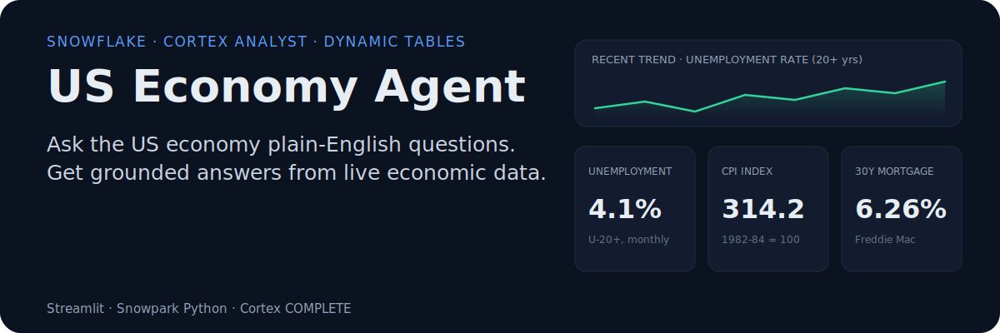
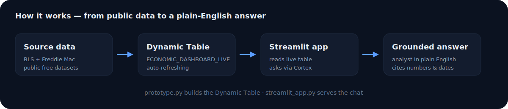

<p align="center">
  
</p>

## What it is

A conversational agent for US macroeconomic indicators. You ask in plain English — "What is the current unemployment rate?" or "How has inflation moved this year?" — and it answers from live Snowflake data, not from a model's memory.

It is built on three Snowflake capabilities:

- **Public free datasets** — BLS `FINANCIAL_ECONOMIC_INDICATORS_TIMESERIES` and Freddie Mac `FREDDIE_MAC_HOUSING_TIMESERIES`.
- **Dynamic Tables** — `prototype.py` shapes the raw feeds into one auto-refreshing `ECONOMIC_DASHBOARD_LIVE` table.
- **Cortex** — `streamlit_app.py` sends 24 monthly snapshots plus the question to `AI_COMPLETE`.

## How it works

<p align="center">
  
</p>

1. **Ingest** — `prototype.py` reads the two public tables with Snowpark and extracts CPI, the unemployment rate, and the 30-year mortgage rate.
2. **Shape** — the three series are unioned, pivoted to one row per date, and promoted to a Dynamic Table.
3. **Ask** — `streamlit_app.py` loads 24 monthly snapshots, shows three live metric tiles, and opens a chat.
4. **Answer** — accepted questions are grounded in those snapshots and sent to Cortex for a concise response.

The second entry point, `ask_us_economy.py`, uses Cortex Analyst against a Semantic View to turn a question into SQL, runs it, and prints the result.

## Getting started

### Prerequisites

- Python **3.13+** and [`uv`](https://docs.astral.sh/uv/)
- A Snowflake account with Cortex access and a warehouse
- Credentials for a role that can read the project data and use the quota table

### Install

```bash
uv sync
```

### Configure

Create the local Streamlit secrets file from the tracked example:

```bash
mkdir -p .streamlit
cp .streamlit/secrets.example.toml .streamlit/secrets.toml
```

Fill in `.streamlit/secrets.toml`. The same TOML content can be pasted into the app's **Secrets** page on Streamlit Community Cloud.

| Setting | Purpose |
| --- | --- |
| `[connections.snowflake]` | Streamlit Snowflake connection credentials and session context |
| `[cortex_analyst]` | Semantic View used by the Cortex Analyst CLI path |
| `[app]` | Quotas, token limits, concurrency, cache and Cortex model |

Before publishing the chat, run `sql/setup_quota.sql` with the owning role. It creates the quota table and grants `US_ECONOMY_APP_ROLE` the least-privilege access required for both quota writes and dashboard reads. The app fails closed if it cannot reserve a request before calling Cortex.

### Run the chat

```bash
uv run streamlit run streamlit_app.py
```

Open the URL Streamlit prints, then ask about unemployment, CPI, inflation, or mortgage rates.

### Run the Cortex Analyst path

```bash
uv run python ask_us_economy.py
```

## Project structure

| File | Role |
| --- | --- |
| `streamlit_app.py` | Chat UI and live metric tiles |
| `src/config/app_config.py` | Typed configuration loaded from Streamlit TOML secrets |
| `src/guardrails/chat_guardrails.py` | Topic, language, character, and duplicate validations |
| `src/services/chat_service.py` | Request pipeline, session limit, duplicate handling and concurrency cap |
| `src/services/snowflake_service.py` | Monthly query, atomic daily reservation and Cortex calls |
| `src/utils/cortex_response.py` | Cortex Analyst response parser |
| `scripts/ask_us_economy.py` | Cortex Analyst → SQL → Python connector demo |
| `scripts/prototype.py` | Snowpark ingestion that builds `ECONOMIC_DASHBOARD_LIVE` |
| `.streamlit/secrets.example.toml` | Safe local and Streamlit Cloud configuration template |
| `sql/setup_quota.sql` | Idempotent daily quota table bootstrap |

## Public usage guardrails

- 50 chargeable requests per UTC day globally, reserved atomically in Snowflake before Cortex.
- 5 chargeable requests per browser session; reloading starts a new session but does not reset the daily limit.
- 1,000 input characters, 3,000 full-prompt tokens and 1,000 output tokens by default.
- At most 2 concurrent Cortex requests per app process.
- Immediate duplicates, unsupported topics and non-English questions are rejected before Snowflake/Cortex work.
- Only the last successful exchange is sent back to Cortex; accepted history remains visible in the current session.

All limits are configurable under `[app]`. There is no administrator bypass. Questions and answers are not persisted or logged.

## Limitations

- Answers depend on the Dynamic Table's refresh schedule — stale data means stale answers.
- Requires Snowflake credentials and Cortex availability; there is no offline mode.
- Session allowance relies on Streamlit session state and resets on browser refresh; the Snowflake daily allowance remains authoritative.
- `ask_us_economy.py` needs a configured Semantic View.

## License

This project does not yet ship a `LICENSE` file. Add one to define usage terms.
